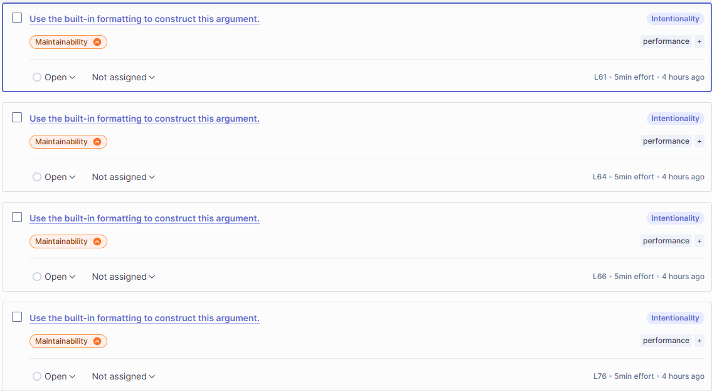
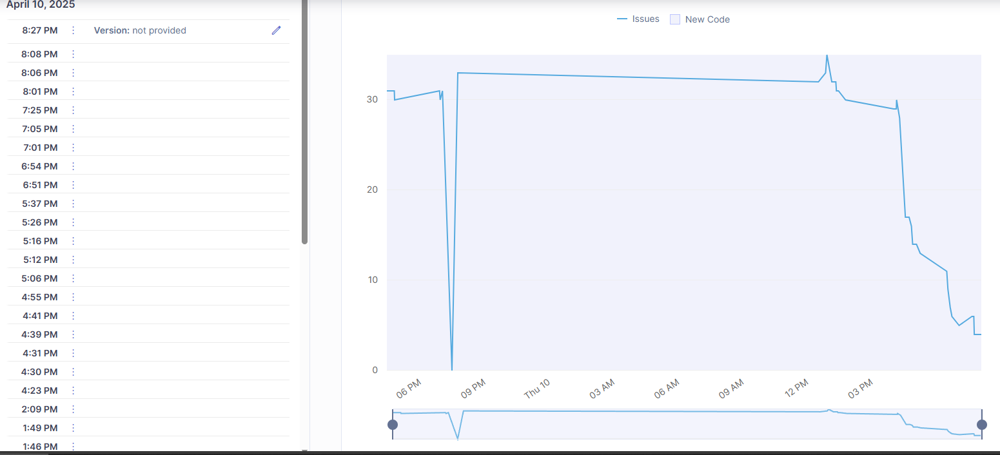

# Trabajo práctico de Refactorización

## Pasos para montar el SonarQube

##### Montar un contenedor con la imagen de sonarqube:community
1. Abrir la cmd (da igual la localización)
2. escribir el comando:
    ~~~
    docker run -d --name nombre_contenedor -p 8010:9000 sonarqube:community
    ~~~
    * _-d_ deja que corra el contenedor en segundo plano, dejando acceso a la terminal.
    * La URL que pondremos será en este caso, localhost:8010.
    * No hay que montar la imagen con Dockerfile porque ya existe dentro de DockerHub

3. escribir el comando:
    ~~~
    docker start nombre_contenedor
    ~~~

4. Dirigirnos a la página local _**localhost:8010**_

5. Iniciar sesión como _admin_, _admin_ para restablecer la contraseña

6. Una vez dentro, tenemos que hacer varias cosas:
    1. Crear un proyecto nuevo. El nombre se utilizará dentro del **_sonar-project.properties_**.
        * En mi caso es RefactorizacionED.
    2. Crear un nuevo token con cualquier nombre, pero tiene que ser **GLOBAL**, si no no funciona el scanner.
        * Se encuentra dándole arriba a la derecha en la 'A' -> My account -> Security -> Generate Tokens.

7. **Suponiendo que tenemos la plantilla del _sonar-project.properties_**, procedemos a rellenarla:

|Llaves de la Plantilla| Información agregada |
|----------------------|:---------------------|
|sonar.projectKey=     | RefactorizacionED    |
|sonar.host.url=       |http://localhost:8010/|
|sonar.login=          | sqa_[...]            |
|sonar.language=       | java                 |
|sonar.sources=        | src                  |
|sonar.java.binaries=  | target/classes       |

_Ten en cuenta que los tres últimos siempre se repiten._

8. Ahora, nos dirigimos a con la cmd a la carpeta raíz de nuestro proyecto. Escribimos el siguiente código para generar la carpeta target/classes (necesaria para que compile el sonar):
~~~
for /r src %f in (*.java) do javac -d target\classes "%f"
~~~

9. Por último, usamos el comando _**sonar-scanner**_ para realizar nuestro análisis de código todas las veces que queramos.

* Cosas a tener en cuenta:
    * El código debe de funcionar
    * SonarQube es muy delicado y de un escáner a otro pueden quitarse todos los issues aún siendo mentira
    * Con la configuración genérica del escáner, tenemos que resolver **todos** los issues para que se ponga en verde.
    * Dentro de cada issue puedes ver una explicación detallada de dónde está la issue, por qué lo es y cómo solucionarlo de forma genérica.

#### ¡Y listo! ¡Ahora sólo hace falta saber refactorizar!

---
# Refactorización

##### Pequeño aviso: He estado haciendo el markdown mientras hacía las comprobaciones y refactorizaba. Puede que se me haya pasado algo por alto.

### Sustituir Clone por Copia de constructor.
Primero traté de solucionar el error tipo **Blocker**, que está intentando hacer una copia de una clase de una forma que nunca va a funcionar, ya que hace "Override" y la función nunca se va a cumplir. 

Su solución fue reemplazarlo por un constructor copia,  una forma más sencilla y más segura de asegurarte que no use una referencia al objeto original, sino una copia real.

### Desanidar funciones grandes
Tras arreglar el problema del constructor copia, me fui a la única issue **High**, que nos decía que el código tenía mucha complejidad cognitiva. Su solución: Desanidar funciones en versiones más simplificadas porque lo que aumenta mucho la complejidad son las funciones anidadas. 
* En este caso, desanidé por completo todo el tema de los comentarios, que muestre si es visitante, etc. Estuve probando hasta llegar al máximo posible de complejidad (15).

### Reparar Separador Visual
Aquí estuve teniendo algunos estragos porque me cargué por completo la funcionalidad del separador visual (la línea de guiones), y me tocó repararla. _Por suerte, no aumentó la complejidad_. 

### Fix de la función CompareTo 
#### (y los issues que consecuentes)

También arreglé la función CompareTo que me daba fallo en eclipse directamente y venía así, y como estaba puesto directamente no se ejecutaba, por eso dejaba correr el código. Resulta que no estaba definido al principio de la clase. 
* Con esto había bajado **1 issue media y 2 low**.
* Esto generó una issue tipo **low** que me ponía que en el primer return que era un integer de un mínimo, que lo cambiase a -1 porque ese tipo de condiciones _if_ siempre iban a retornar -1, 0 o 1, y que me recomendaba cambiarlo a -1, y así hice.

#### Arreglo de un arreglo
* Al crear el constructor de copia reemplazando al clone, aparentemente generé una low issue porque el nombre de la copia no seguía las normas de lectura para el tema del mantenimiento del código y la legibilidad de éste. Cambiando el nombre de Copia a copiaGestor ya lo daba por bueno. 
    * También me apareció en el método _Visitantes_ y en los nombres de método _JugadorComoLocal_ y _Comentario_, e hice lo mismo; ahora se llaman _jugadoComoVisitantes_, _comentarioResultados_ y _jugadoComoLocal_.

#### println y Logger
Lo siguiente de la lista me lo quería quitar porque eran muchas issues y fáciles de solucionar: cambiar _System.out.println_ por _logger.info(" ")_. 

Esto hace que cambie por completo cómo devuelve la respuesta por consola, ahora apareciendo la fecha y hora, paquete, clase y función dentro de ésta. Además, sale en rojo. 
Sonarqube recomienda esta opción porque mejora las capacidades tanto de seguridad como de legibilidad de la información sensible. 
* Ha hecho falta importar la clase de **_java util_** llamada _logger_, que funciona de la misma manera que funciona el Scanner: Defines el import, creas un objeto (de la clase Logger), la cuál usas exactamente igual que el _println_, pero sustituyéndolo por _**logger.info**_.

#### ¿Hay resultados? Y la expresión verdadera
En la verificación de _si hay resultados y salida del programa si se cumple_, la primera condición es inútil porque siempre va a dar como valor _booleano_ true. _Eliminando esto también aliviamos la carga de complejidad cognitiva_.

#### Depuración de líneas inútiles
He eliminado algunas líneas que no hacían falta: 
>La línea de _BigDecimal_ que calculaba el presupuesto nunca se usaba, así que no es necesario. 
>Con esto iba el importe que le hice para arreglar otro issue anteriormente _(de la misma función)_ matando dos pájaros de un tiro.
> La línea que declaraba un _field_ privado llamado partidosTotales, que tampoco se utilizaba.
> La variable local _resultadosArray_ que convierte la lista de resultados en array no tenía uso.

#### Arreglo de la comprobación de nombres del main
Ahora la función que comprueba si los nombres son iguales sí que funcionan gracias al formato de logger de condición-exception.
* He movido los métodos del main para que se ejecute primero la comprobación del nombre. 
    * Ahora si se llaman igual, no sale nada más.

#### Solución equals de dos objetos iguales
He solucionado una issue donde el **equals** que comparaba si dos objetos son el mismo objeto, que _en sonar aparecía que java tenía un contrato en el que tenía que añadir una función hashcode_. Siguiendo las instrucciones de sonarqube, he ido probando hasta que no diese error.

#### Formateo del código simple
Por último, he reformateado el código para que se vea más claro con la función de Eclipse File -> Source -> Format. No cambia código.
|Eclipse|
|-----------------------|
|1. Entramos en File (arriba a la izquierda)|
|1. Seleccionamos Source|
|1. Nos dejará formatear los espacios de nuestro código.|
 
 _**Nota que si lo intentamos hacer en el .java directamente no funciona**_

---

El código a estas alturas ya es una cosa funcional. Sin embargo, en el sonarqube **no pasa la aprobación** porque me quedan 4 issues por resolver: _**los formatos de los logger**_. 
* Conseguí sustituir los _println_ por los _logger_, pero ya en los formatos sí que no entiendo nada de nada. Es lo único de la clase que no funciona. Estuve probando todos las las soluciones de todas las maneras y me daba un error ilógico, que tenía que cambiar la funcionalidad del logger.
    * El único que pude cambiar fue el del condicional del main porque lo entendía y me funcionaba.
        * Me daba un error que tras investigarlo, no se me permite arreglarlo mediante los formatos porque _no es adecuado para formatear cadenas en JAVA9+_. 
        
    **La solución era algo que se me salía de las manos y prefiero no meter algo que no entiendo antes que meterlo por la cara.** 

***

Sin más dilación, **aquí muestro fotografías de las issues restantes**, como de la actividad estas últimas horas el cómo ha ido bajando poco a poco:

_Aquí se pueden ver los issues restantes_

_Y aquí la gráfica de issues con el tiempo_

# Javadoc

## Montaje de la carpeta docs

_**Javadoc NO FUNCIONARÁ si no tienes instalado Java JDK.**_

##### Verificar si tienes javadoc instalado

1. En la cmd, escribe el comando:
~~~
javadoc -version
~~~
¿No te funciona? Reinstala Java JDK.

2. En caso de que te salga que existe pero _que no se reconoce como un comando interno_, tienes que dirigirte a la **configuración de variables de entorno**, y dentro de **PATH**, añadir la ruta de javadoc.exe.

|¿Cómo hago eso?|
|-----------------------|
|1. Windows + R|
|2. _sysdm.cpl_|
|3. Pestaña de Opciones Avanzadas|
|4. Abajo, _Variables de entorno..._|
|5. Busca Path y dale a Editar|
|6. Agrega la ruta al **bin** del JDK|

_La ruta por defecto es C:\Program Files\Java\jdk-23\bin_

3. Una vez hecho esto, comprueba poniendo el comando:

~~~
javadoc --help
~~~

Si te va, podemos continuar.

4. Dirígete a la carpeta raíz del proyecto. Te enseño el comando que he utilizado yo para que se genere la carpeta:
~~~
C:\Users\samue\eclipse-workspace\TrabajoRefactorizacionED\src -subpackages practica_refactorizacion_casa
~~~
_Cuidado con el subpackages, tiene que ser la ruta desde el \src._

Siguiendo estos pasos, ya deberías de tener la carpeta docs con el javadoc generado. ¡Felicidades!
    * Para comprobarlo, dirígete a la carpeta _docs_ desde el explorador de archivos e inicia _**index.html**_.

Aunque todavía queda rellenarlo...

## Relleno de javadoc

#### Nota: Cada vez que modifiques el código de cualquier manera, hay que volver a ejecutar el comando de javadoc. Por eso lo he puesto al final. Y no, no genera conflictos con sonarqube.
    
* Digo que no genera conflictos porque tener un método en comentario sí que lo hace.

Antes de nada, voy a definir los _Block tags_ e _Inline tags_:
* Block tags: Se usan para describir partes completas del método, como parámetros (@param), retorno (@return), excepciones (@throws), y referencias a otros elementos (@see).

* Inline tags: Se usan dentro del texto para hacer referencias rápidas a clases, métodos o campos (@link), formatear texto como código (@code), o mostrar texto literal (@literal).

Una vez entendemos esto, podemos ver un ejemplo de cada característica de javadoc puesta en mi código:

|Término               | Uso general          | Uso práctico     |
|----------------------|:---------------------|:-----------------|
|@author (Línea 10) |  Indica el autor del código fuente.    | Aparece mi nombre al principio del código|
|@version (Línea 11) | Especifica la versión del código o del proyecto. | Aparece Versión 1.0 al principio del código |
|@param (Línea 27) | Descripción de un parámetro de un método. | Se usa para detallar los parámetros de entrada en cada método de la clase.|
|@return (Línea 137) | Indica lo que retorna un método.  | Se usa para describir el valor de retorno de los métodos de la clase. |
|@see (Línea 12) | Referencia a otro elemento relacionado o complementario. | Sirve para enlazar el método equals con hashCode por su relación de implementación. |
| @throws (Línea 38)| Indica las excepciones que un método puede lanzar. | Explica la funcionalidad de la excepción de ese método. |
| @link (Línea 186) | Enlaza a una clase, método o campo dentro del Javadoc. | En el método CompareTo, se puede clickear para que te lleve a la clase GestorFutbol, donde al principio se comparan los nombres. |
| @exception | Similar a @throws, pero utilizado para documentar las excepciones. | No se utilizó directamente en este código, pero se podría emplear para documentar excepciones personalizadas. |

_Aún estando así, funciona correctamente._

# Subida a un Repositorio Remoto en GitHub

Como no especificaba en ningún sitio y no se tenía que enviar el proyecto entero. Existen dos formas de hacerlo: Mediante la CMD, usando git add, commit y push, o arrastrando directamente los archivos. Primero explicaré la forma de arrastrar que es el método que yo utilicé (ya que no pedían branches ni proyectos enteros, sólo 3 archivos), y luego explicaré la forma _oficial_.

##### Forma fácil:
1. Crear un repositorio nuevo público en GitHub
2. En el centro, donde aparece un recuadro azul que se llama _Quick Setup_, justo debajo del enlace a nuestro _git_ podemos ver la opción de **subir los archivos de forma manual**.
3. Al entrar, meramente tenemos que arrastrar los archivos que se requieren, haces un commit **con un nombre significativo**, ¡y listo!

##### Forma usando CMD (Se envía todo el proyecto)
1. Crear un repositorio nuevo público en GitHub
2. Copiar el enlace del recuadro azul _Quick Setup_ para poder vincular nuestra carpeta local con la remota.
3. Dirigirse a la carpeta de nuestro proyecto, abrir esa ruta en la CMD y escribir lo siguiente:
~~~
git init
~~~
_Esto crea un repositorio local vacío. Lo sabes porque se genera una carpeta invisible llamada .git._
~~~
git add .
~~~
_Añade todo lo que se encuentra dentro de esta carpeta a un commit temporal_
~~~
git commit -m "Adición del código, readme y sonar.properties"
~~~
_Se crea el commit, listo para enviarlo al repositorio remoto_
~~~
git remote add origin https://github.com/MarcusAureliusNV/gestor-futbol-refactorizado.git
~~~
_Enlaza la carpeta local con la url del repositorio remoto y le da el nombre por defecto origin para no tener que escribir otra vez el enlace_
~~~
git push -u origin main
~~~
_Manda desde la ruta origin (el repositorio remoto)_
_-u sirve para hacer un Upstream; le indica a git a qué rama está conectada_

Como no se hace mediante una branch, no hace falta hacer un _Pull Request_ para hacer merge a la main de la remota.

Con esto, se finaliza todo lo que se pide en esta actividad.

## Conclusión
Sinceramente, una vez le echas horas a todo, lo acabas _"entendiendo"_ y te resulta hasta _"fácil"_. Claro, cuando te funcionan los entornos. Espero que sea de su agrado este magnífico Markdown que **he escrito enteramente yo**, sin ayuda de ninguna IA, **y para poner fin a esta documentación...**

# ...Gracias por leer.